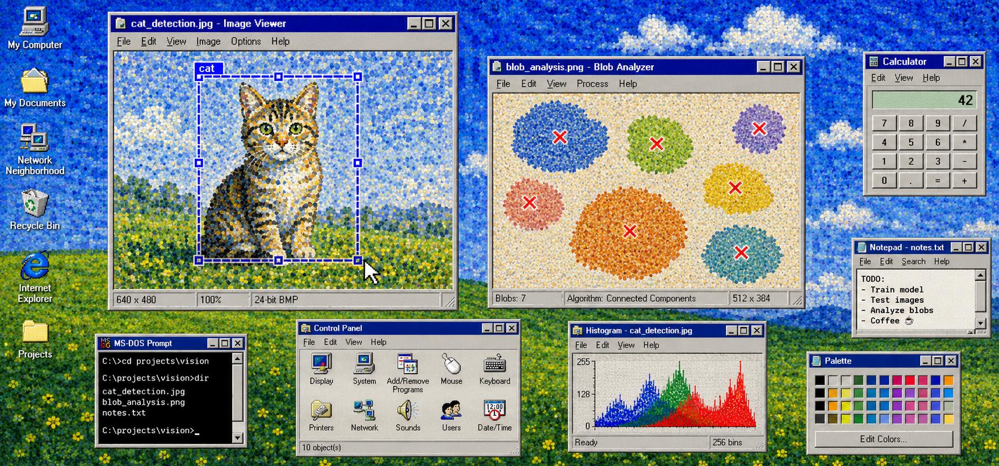

<h1 align="center">Hi there, I am Akash! 👋</h1>

I enjoy exploring how computers can make sense of complex visual data, especially through computer vision and machine learning. Much of my recent work has involved microscopy—detecting features in images, aligning 2D and 3D data, and making research software faster and easier to use. I am also interested in probabilistic modeling, energy forecasting, and turning experimental ideas into dependable tools. 

Mostly, I like understanding how things work and building technology that is genuinely useful. 

## Professional Trivia ⁉️
- **Where do I work?** University of Michigan Life Sciences Institute 🔬
- **What is my professional title?** I am a Research Associate, but more like a Computer Vision Engineer
- **Which one is my preferred programming language?** Python 🐍
- **Which one is my favorite Python library?** PyTorch 💖
- **What are my most GitHub repos based on?** Computer Vision 👀 with some dash of LLMs 🤖
- **What I drink the most while at work?** Umm, water.

## Publications 📑

In my published works, I have explored time series analysis and development of surrogate models using machine learning methods for tackling various problems.

- **Mahajan, A.**, Chaturvedi, S., Das, S., Su, W., & Bui, V. H. (2025). _Optimal parameter design for power electronic converters using a probabilistic learning-based stochastic surrogate model_. Next Energy, 9, 100464. [[Link](https://www.mdpi.com/2071-1050/16/22/9943)]
- **Mahajan, A.**, Das, S., Su, W., & Bui, V. H. (2024). Bayesian-neural-network-based approach for probabilistic prediction of building-energy demands. Sustainability, 16(22), 9943. [[Link](https://www.sciencedirect.com/science/article/pii/S2949821X25002273)]

**Masters Thesis (University of Michigan)**: [Uncertainty-Aware Probabilistic Machine Learning for Prediction and Design Optimization in Energy Systems](https://deepblue.lib.umich.edu/items/d51916b3-678c-45b9-a3b3-2ece5d7209cc)

## 🔗 Connect with Me
- **Email**: [akashmahajan025@gmail.com](mailto:akashmahajan025@gmail.com)
- **LinkedIn**: [linkedin.com/in/thisisakashmahajan](https://linkedin.com/in/thisisakashmahajan)
